# Разностные методы решения уравнений газодинамики

Программа реализует[^1] численное решение уравнений одномерной идеальной газодинамики методом Хартена-Лакса-ван Лира (HLL).

С помощью данной программы моделируется распад произвольного газодинамического разрыва в идеальном газе с показателем адиабаты $\gamma = 5/3$.
Рассматривается область $x \in [-0.5,0.5]$, полагая, что первоначально разрыв находится в точке $x = 0$.

Программа протестирована для трех начальных условий:
1. $\{\rho, v, p\}_L = \{1, 0, 3\}$,
   $\{\rho, v, p\}_R = \{1, 0, 1\}$;
2. $\{\rho, v, p\}_L = \{1, 1, 3\}$,
   $\{\rho, v, p\}_R = \{1, -1, 1\}$;
3. $\{\rho, v, p\}_L = \{1, -0.1, 1\}$,
   $\{\rho, v, p\}_R = \{1, 0.2, 1\}$,

здесь индексы $L$ и $R$ обозначают характеристики газа (плотность, скорость, давление) слева и справа от разрыва соответственно.

На границах расчетной области использовались граничные условия типа Дирихле в предположении о постоянстве всех ГД-величин.

Выполнены следующие серии расчетов (см. Приложение):
- **A**. Расчеты для различных значений числа ячеек сетки $N = [40, 80, 160, 320]$ на примере варианта 1. Проанализирована сходимость метода.
- **B**. Расчеты для различных значений числа Куранта $C = [0.3, 0.6, 0.9]$ на примере варианта 1. Проанализированы диффузионные и дисперсионные свойства схемы.
- **C**. Промоделирован распад разрыва для вариантов 1, 2 и 3 с помощью оптимальных значений $N$ и $C$, выбранных на основе расчетов A и B.

## Запуск

Для запуска программы с решением задачи Римана необходимо в терминале из текущей директории выполнить команды

```bash
g++ functions.cpp iof.cpp main.cpp -o main
./main
```
  
Далее следуйте указаниям интерфейса (будет необходимо ввести номер теста).

Чтобы построить график, используйте команду 

```bash
python3 result_processing/graphs.py
```
  
Далее придется повторить ввод номера нужного теста.

[^1]: Данная работа выполнена в команде из двух человек: меня ([В. Кобозевой](https://github.com/vvickia)) и [А. Лунченко](https://github.com/lunchenkoa).

## Приложение

- **A**-**B**. Представим графики для набора $N = [40, 80, 160, 320]$ при различных числах Куранта $C = [0.3, 0.6, 0.9]$ на примере теста 1.

<p align="center"><small>Данные графики демонстрируют улучшение решения по мере увеличения числа ячеек N при одинаковом числе Куранта C = 0.3</small></p>

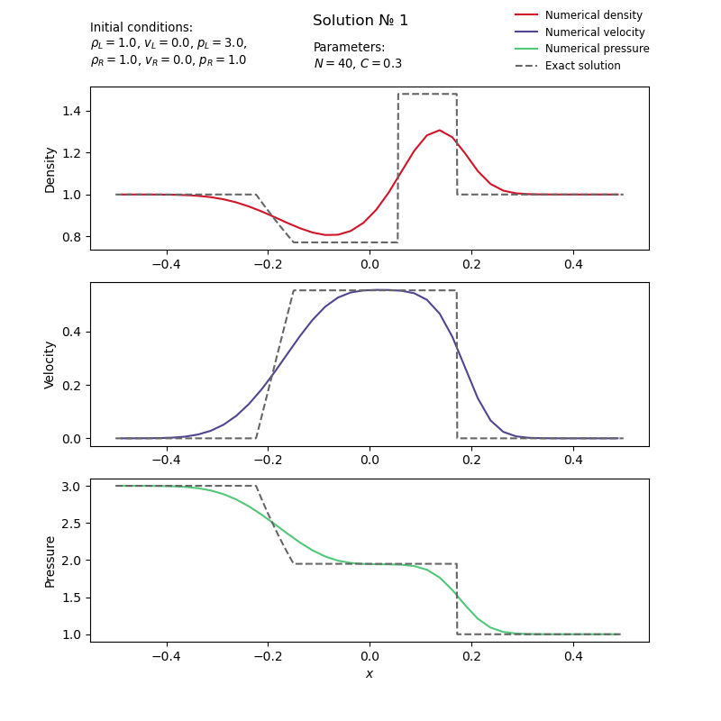{width=49.5%} 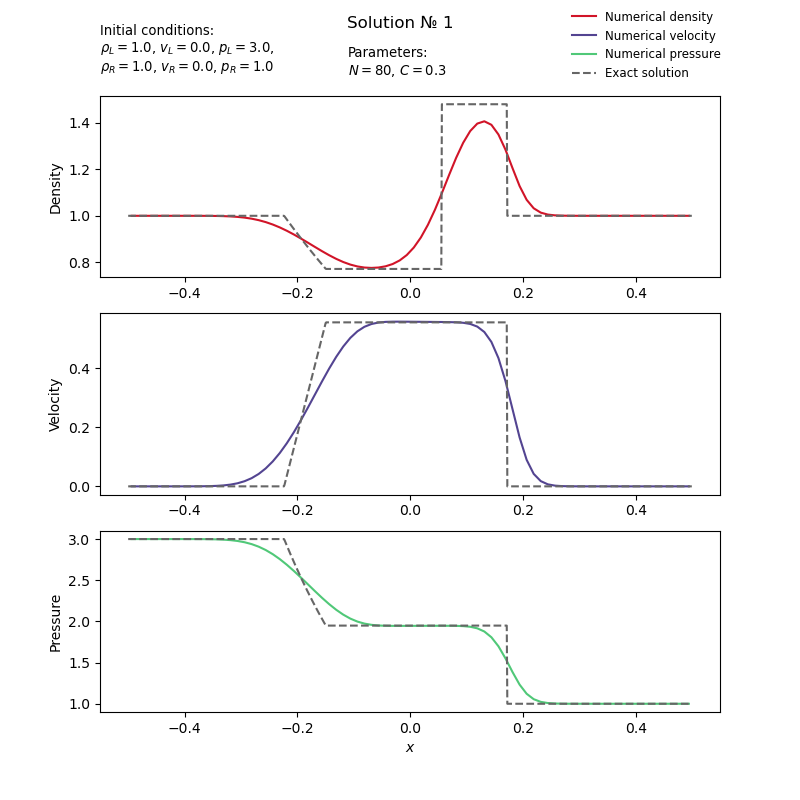{width=49.5%}
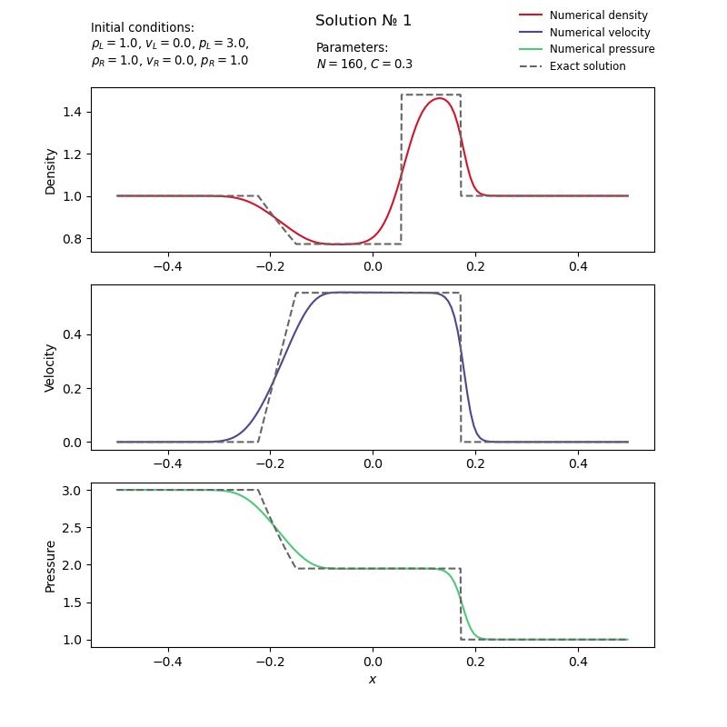{width=49.5%} {width=49.5%}

<p align="center"><small>Данные графики демонстрируют улучшение решения по мере увеличения числа ячеек N при одинаковом числе Куранта C = 0.6</small></p>

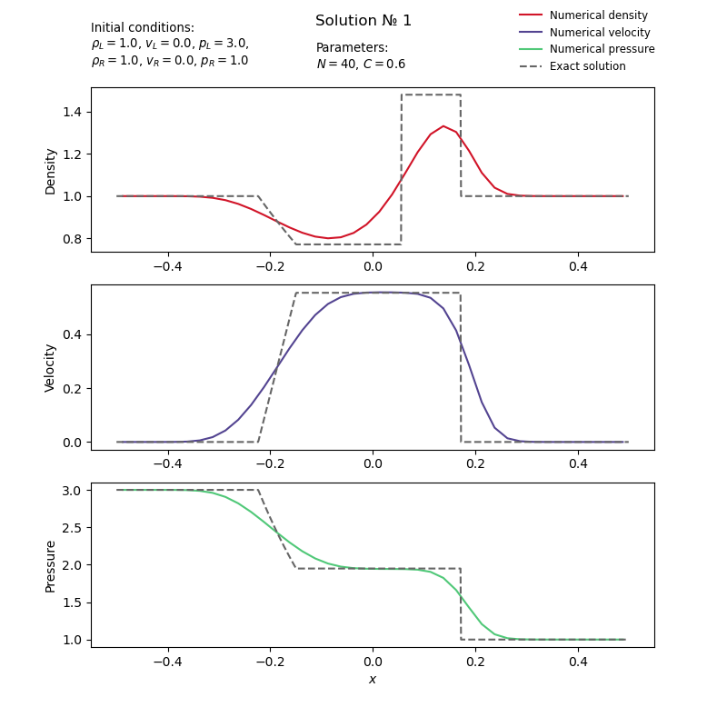{width=49.5%} 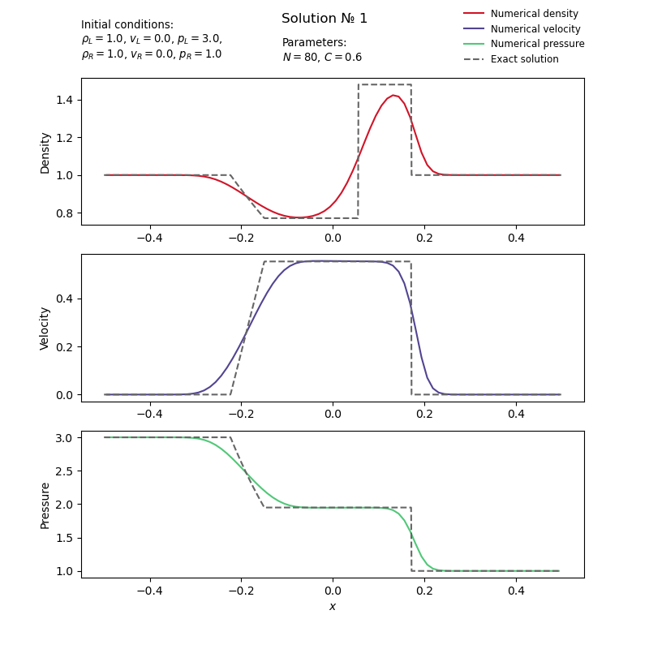{width=49.5%}
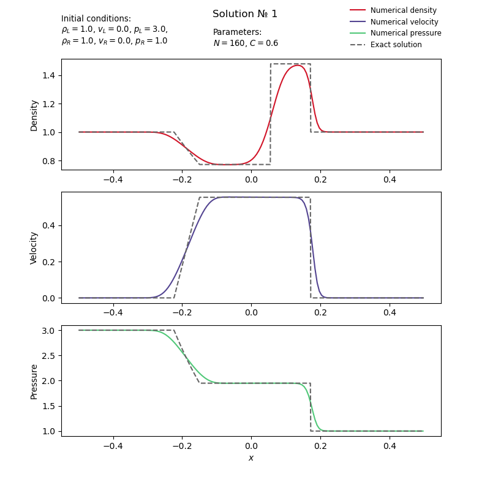{width=49.5%} 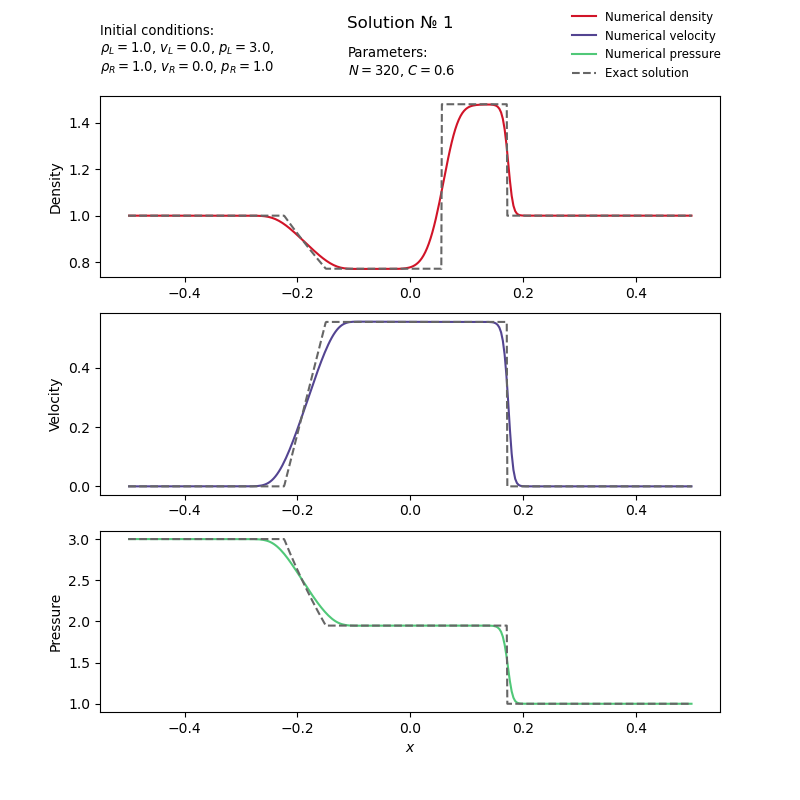{width=49.5%}

<p align="center"><small>Данные графики демонстрируют улучшение решения по мере увеличения числа ячеек N при одинаковом числе Куранта C = 0.9</small></p>

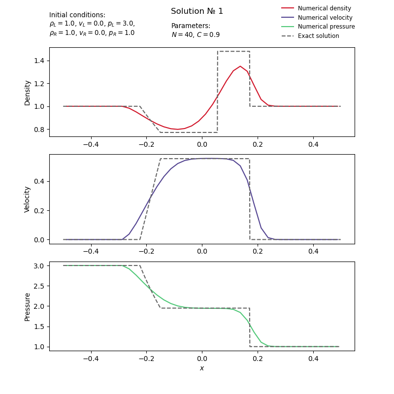{width=49.5%} 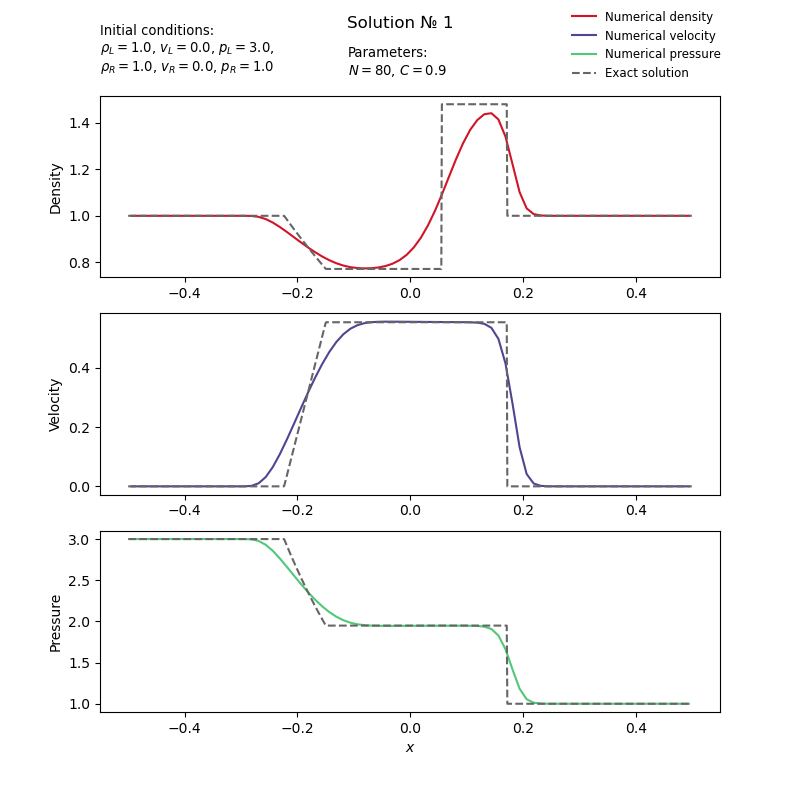{width=49.5%}
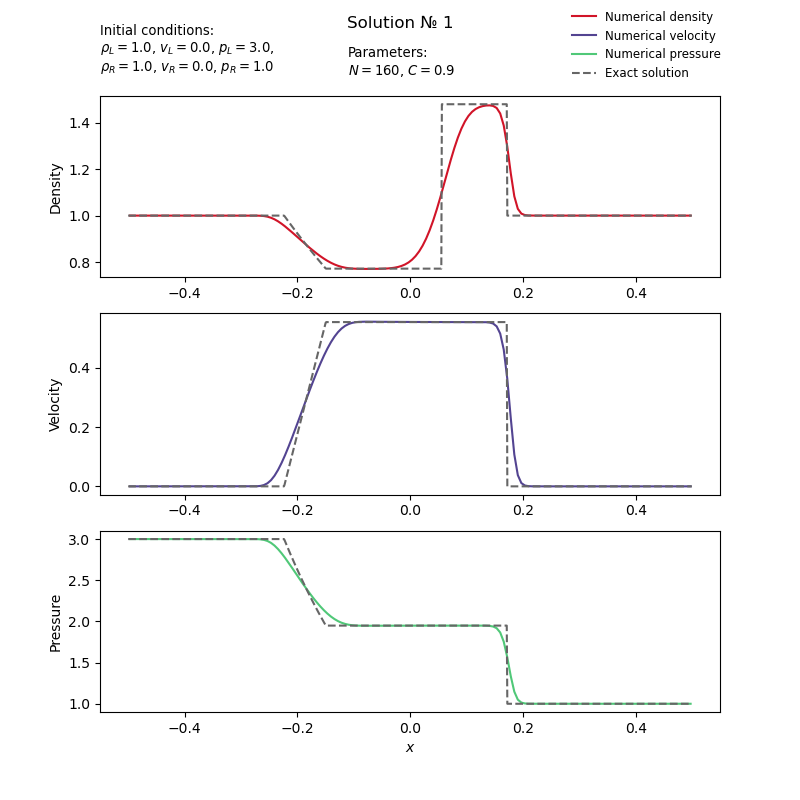{width=49.5%} {width=49.5%}

- **C**. На основе расчетов A и B найдены оптимальные значения $N = 320$ и $C = 0.9$, с которыми и представим промоделированный распад разрыва для тестов 1, 2 и 3.

{width=32.5%} 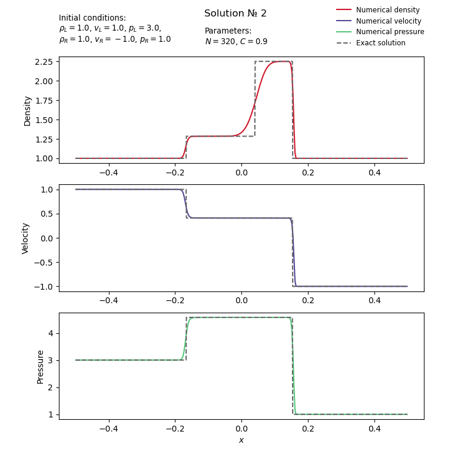{width=32.5%} 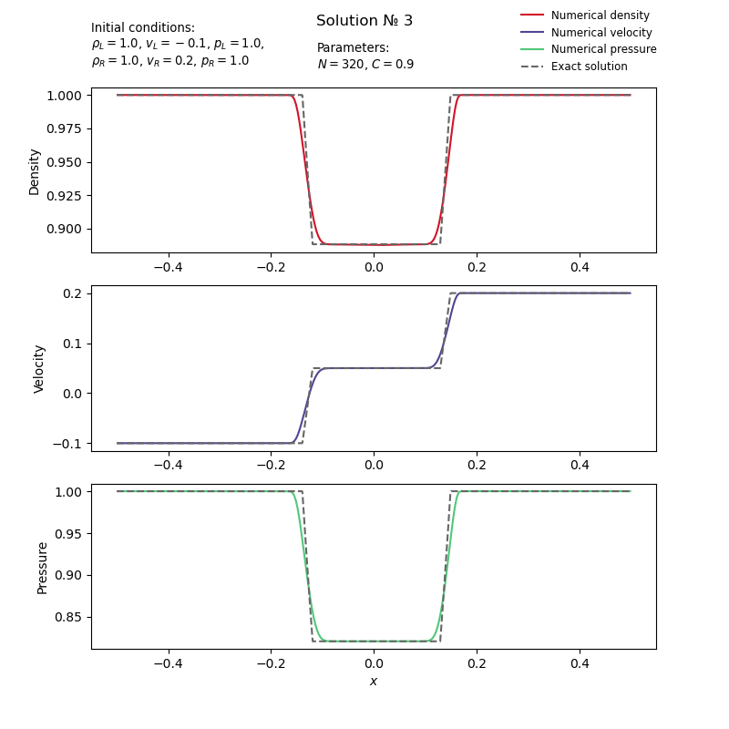{width=32.5%}
